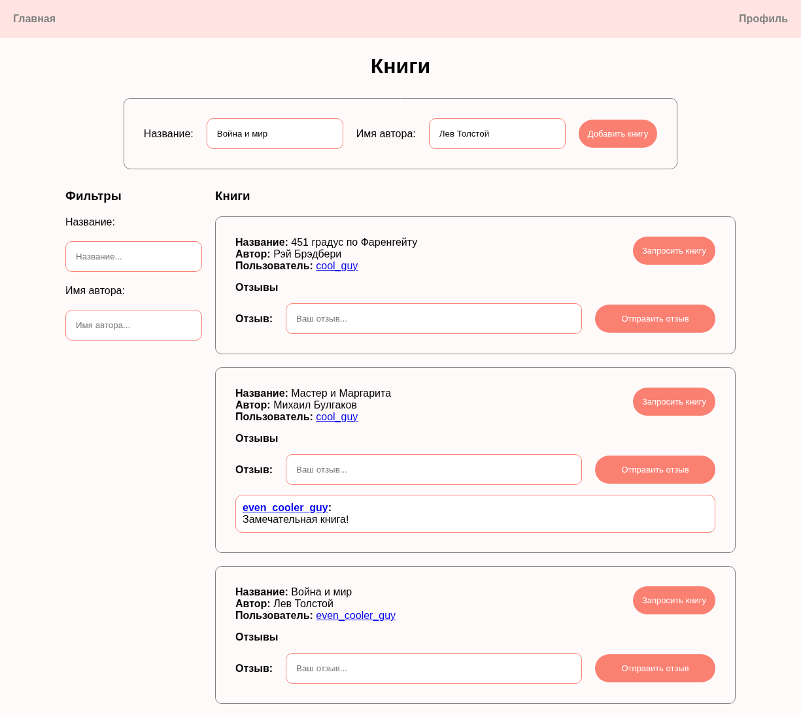
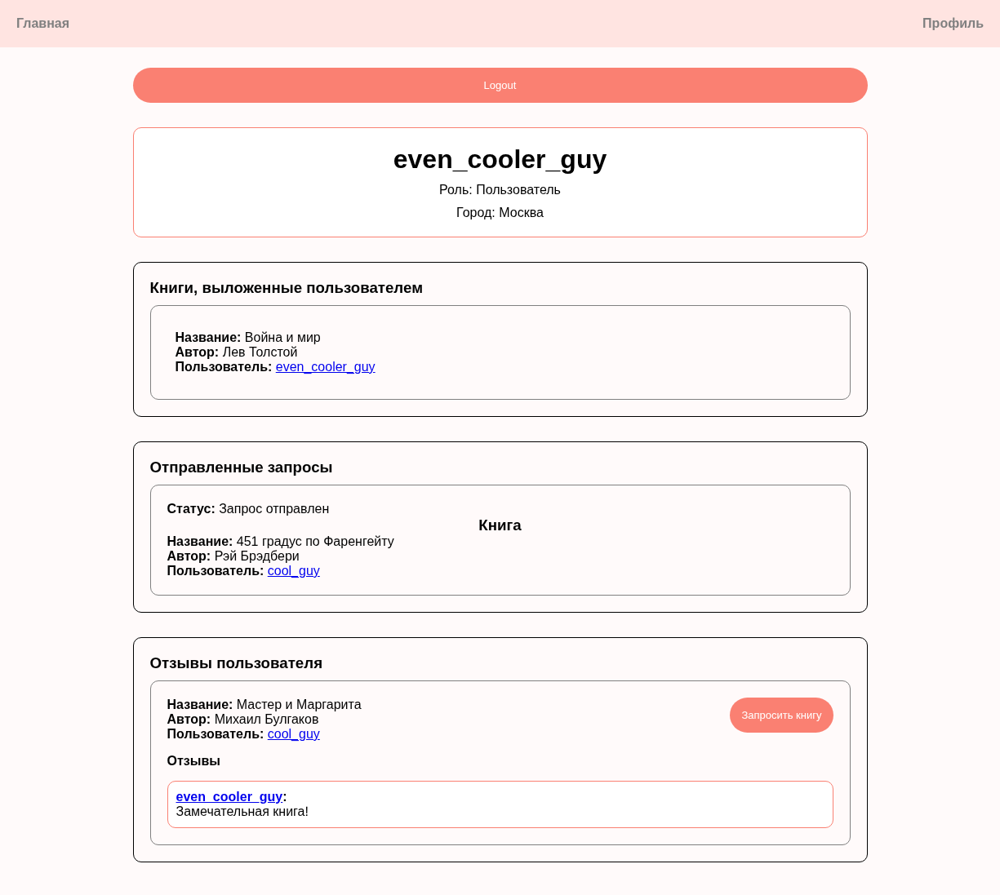

# Сайт по обмену книгами

Сайт, где каждый может опубликовать пост с книгой, которой он хотел бы поделиться, запросить книгу и оставить отзыв о ней.

## Инструкция
- **Команда запуска:** `sudo docker compose up`;
- **Адрес сайта:** http://localhost:3000;
- **Команда остновки:** `sudo docker compose down`.

## Технологии
- **Frontend:** React;
- **Backend:** Java (Spring), Go (Управляет входом в аккаунт, созданием нового аккаунта и подключается к Java с помощью gRPC);
- **Другое:** PostgreSQL, Docker.

## Скриншоты

